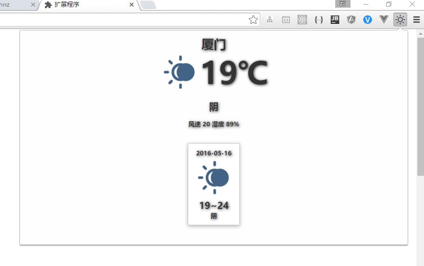

<<<<<<< HEAD
戳这里右键另存为：<https://github.com/yohnz/weather/weather.crx>


### 创建文件
新建weather文件夹，里面包含manifest.json，popup.html和images文件夹。images文件夹放16,48,128三种不同尺寸的图标

manifest.json内代码如下：
```
{
  "manifest_version":2,
  "name":"极简天气",
  "description":"极简天气预报",
  "version":"1.0",
  "icons": {
        "16": "images/sun16.png",
        "48": "images/sun48.png",
        "128": "images/sun128.png"
   },
  "browser_action":{
      "default_icon":"images/sun48.png",
      "default_title":"天气预报",
      "default_popup":"popup.html"
  },
   
}
```

popup.html的代码如下：
```
<!DOCTYPE html>
<html lang="zh">
<head>
    <meta charset="UTF-8">
    <title>天气</title>
</head>
<body>
 <div class="weather">    
    Test    
 </div>
</body>
</html>
```
### 文件说明

**manifest.json**

必需文件，是整个扩展的入口，每个Chrome扩展都包含一个Manifest文件。Manifest必须包含name、version和manifest_version属性。

属性说明：

- `manifest_version`指定文件格式的版本，在Chrome18之后，应该都是2
- `name`扩展名称
- `version` 扩展版本号
- `version`扩展的版本
- `icons`扩展列表图标
- `browser_action`指定扩展在Chrome工具栏中的显示信息。
- `default_icon`、`default_title`、`default_popup`依次指定图标、标题、对应的页面

**Popup页面**

Popup页面是当用户点击扩展图标时，展示在图标下面的页面。

打开chrome扩展程序界面，勾选"开发者模式",拖入weather文件夹，然后就可以看到weather扩展已经出现在chrome扩展程序列表了


同时，工具栏也出现了weather的图标，点击之后会弹出popup界面:


### 完善页面和样式
完善静态popup页面,模拟天气数据:
```
<!DOCTYPE html>
<html lang="zh">
<head>
    <meta charset="UTF-8">
    <title>天气</title>
</head>
<body>
    <div class="weather">
        <div class="today" id="today">
            <h1 class="city">厦门</h1>
            <div class="row_detail">
                <h1>19<span>℃</span></h1></div>
            <div class="wind">
                <h2>阴</h2>
                <h4>风速 20   湿度 89%</h4></div>
        </div>
        <div class="content">
            <div class="wrap" id="wrap">
                <div class="row">
                    <h4>2016-05-16</h4>
                    <h1>19~24</h1>
                    <h4>阴</h4>
                </div>               
            </div>
        </div>
    </div>
</body>
</html>
```

新建CSS文件，并在popup页面引入
```
body{
    width:740px;
    height:400px;
    font-family: 'Microsoft Yahei';
    color:#333;
    background:#fefefe;
    text-shadow:1px 1px 6px #333;
}

.city{
    text-align:center
}
.today{
    padding-bottom:30px;
}
.row_detail{
    display: flex;
    direction: row;
    justify-content:center;
    align-items: center;
}
.row_detail img{
    width:80px;    
}
.row_detail h1{
    font-size:60px;
}
.wind{
    text-align: center;
}
.content{
    display: flex;
    direction: column
}

.wrap{
    display: flex;
    direction: row;
    flex: 1;
    justify-content:space-around;
    align-items: center;
}
.row{
    background:#fff;
    border:1px solid #ccc;
    padding:10px;
    box-shadow: 0 2px 10px rgba(0,0,0,.3);
}
.row img{
    width:80px;
}
.row h1{
    font-size:18px;
}
h1,h4{
    text-align: center;
    margin:0;
}

```
点击工具栏weather图标，此时界面如图：



### 获取真实天气数据
Google允许Chrome扩展应用不必受限于跨域限制。但出于安全考虑，需要在Manifest的permissions属性中声明需要跨域的权限。
这里以[和风天气API](http://www.heweather.com/)为例.
首先，在Manifest里添加要请求的API接口：
`
"permissions":[
     "http://api.openweathermap.org/data/2.5/forecast?q=*",   
  ]
`
=======
**To see more details：**
 http://yohnz.github.io/weather
>>>>>>> 5e72dc31871efa54d70bbe0077ab6379a5947e23
